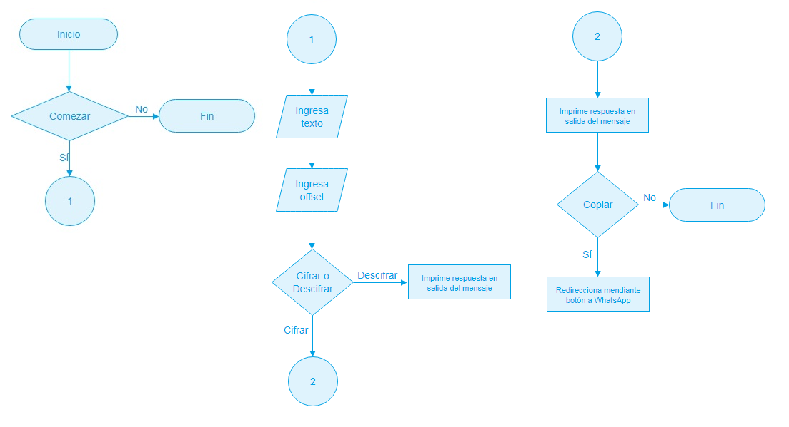

# CipherText

## Preámbulo

Está próxima la fecha del cumpleaños de tu flacx (novix) y estás organizando una
fiesta sorpresa. Para organizar la fiesta has creado un grupo de Whatsapp junto
con amigos y familiares.

Un gran problema es que pones tu alarma para levantarte temprano, sin embargo
(como supondrás) eso nunca sucede y tu flacx es quien termina apagando la alarma
y "de casualidad" revisando tus mensajes. Debido a que es algo sorpresa, decides
crear una aplicación que te permita enviar mensajes cifrados y que las demás
personas (partícipes de la fiesta) puedan tener una interfaz para
descifrarlo. Así que ahora te toca aplicar tus superpoderes.

## Introducción
* Los principales usuarios de esta App son tanto nativos digitales como inmigrantes digitales.

* El objetivo de estos usuarios en relación con el producto es la privacidad de sus comunicaciones, a través del cifrado de mensajes, que ha sido hasta ahora una de las técnicas más populares a la hora de proteger información.

## Funcionalidad

Utiliza un cifrado que proporciona privacidad para cada mensaje. Basado en el Cifrado César conocido por ser un cifrado de sustitución.
Con un entorno fácil de usar.
Proporciona además redireccionamiento a WhatsApp.

 

## Decisiones de Diseño

Empecé por un diagrama de flujo que plasma la interacción del usuario con la aplicación. Lo tome como un mapa (hoja de ruta) que me coloca en la posición de usuario, donde al recorrerla para obtener lo que busca, tendrá momentos que lo llevarán a tomar decisiones. Sin embargo estas no deben implicar complicaciones por lo que se le plantearán alternativas simples y agradables. 

Entonces definí en la interfaz una intro para que la primera vista le permita al usuario tener clara la finalidad del producto.
Para lograr esto pense en el detalle de emplear una imagen y una breve línea descriptiva de presentación.

Establecí un color sólido porque aplicaciones de conectividad que brindan servicio de mensajería, tales como Facebook y WhatsApp tienen esa característica con el azul y verde respectivamente.

Las razones sobre la cantidad y distribución de elementos como: casillas de texto y botones, fue en primera para evitar el uso del scroll y en segunda, para conservar la comodidad de no cambiar la orientación de visualizacion de vertical a horizontal en dispositivos.
